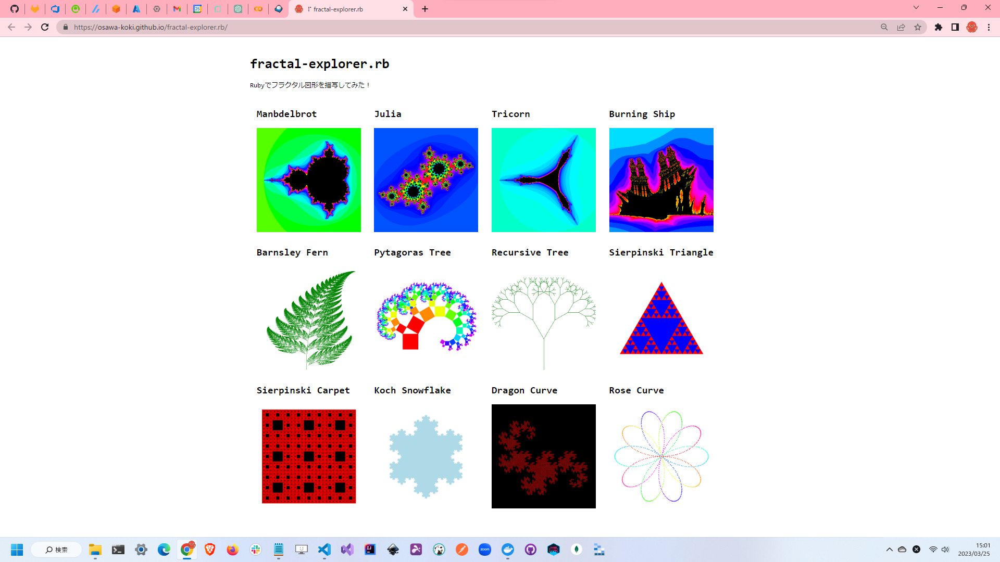

# fractal-explorer.rb

🍬🍬🍬 Rubyでフラクタル図形を描写してみる！  

  

## 実行方法

```shell
ruby ./app/★★★.rb
```

各スクリプトは`./app`ディレクトリに配置してあります。  
また、`./config.toml`には設定ファイルがあります。  

---

全てのスクリプトを実行するには、`./run.sh`を実行してください。  

## 環境情報

| Name | Version |
| --- | --- |
| Debian GNU/Linux | 11 |
| Ruby | 3.2.1 |

## CI/CD

GitHub Actionsを使用しています。  
`./.github/workflows/run.yml`に設定ファイルがあります。  

`main`ブランチにプッシュすると自動でGitHub Pagesにデプロイされます。  
